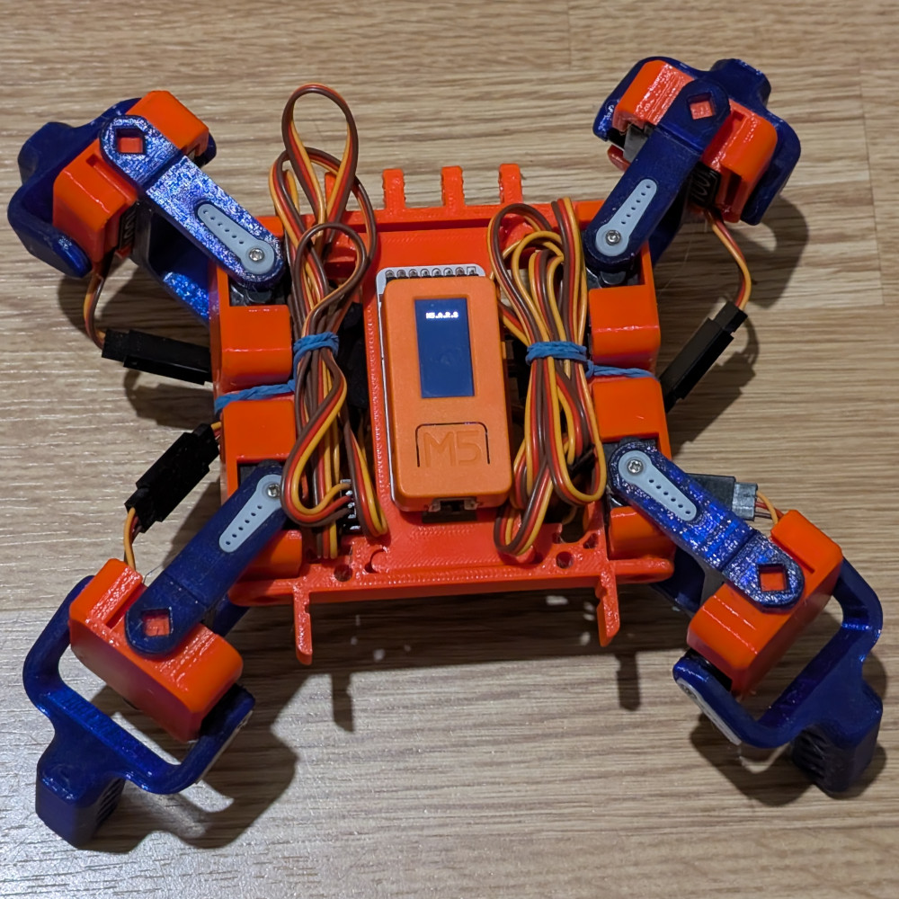

# Arduino code for M5.A.R.S project

 * The bot is controlled thanks to an bluetooth joypad
 * Please install ESP32 + Bluepad32 Arduino / M5Stick-C
 * Tested with M5Stick-C (first version)

## Links
- https://www.smarsfan.com/
- https://www.thingiverse.com/thing:2755973
- https://www.hackster.io/AJB2K3/m5-a-r-s-quad-372968
